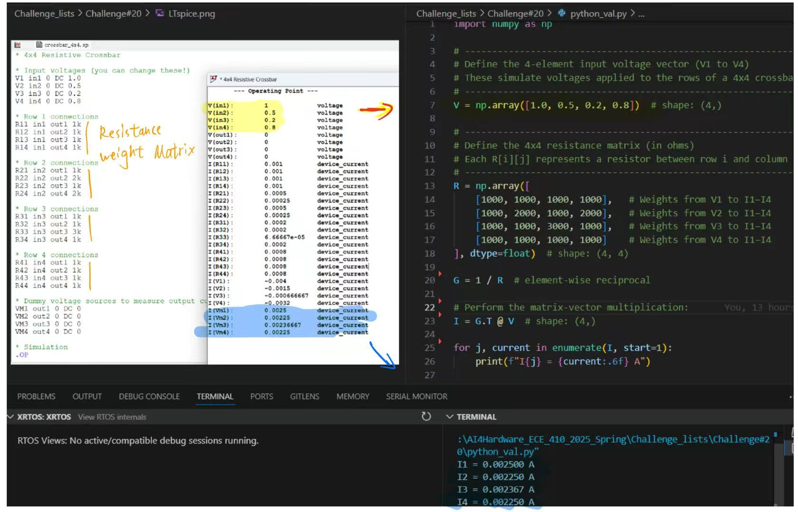

# Challenge #20
**Eric Zhou**  
**May 11, 2025**

# intro
In this task, we are going to do the resistive crossbar. Crossbar is a hardware implementation for Neural Networks. fully analog Massively Parallel Multiply-and-Accumulate (MAC) design that we can benefit a lot from such design. Benefical can be from speed energy efficiency and totally scalable design. This challenge aims to build a LTspice simulation analog circuit for crossbar test.

# Crossbar
How is the design detail? Why it can be eneergy-effective? 

As the design in analog, all the input would be simply 4 voltage input. Through connection like below graph, we finally map our circuit like a crossbar array. For each column, all the current meets together. We can tell from the circuit analysis that I will be each current flow through each G. So easily we can tell from the fomula that if all the voltage is the input, all other conductance value can be the weight vector, then MAC to the result of one neuron output. all the columns together forms the whole output from the neural network! The whole analog circuit forms an direct implementation of a nn for one hidden layer.

# Spice implementation

This challenge uses Spice to simulate the behavior of such analog MAC. I asked Chatgpt to generate Spice code for me for rapid constrction of the circuit. But I am not that familiar about the details function of the Spice, I also chat with it to give me instructions how should I go to place my code to generate the circuit and do the simulation. GPT generate the sp code and guide me through LTspice to run the implementation. My result generated as an output value list. I recognize our useful list V1-4 and I1-4, which are the input and output of our design. 

How to verify our work acctually work? I comed up with an idea that I should use python code to do rapid check of my result. Actually, we can tell from our above circuit caculation that the weight matrix is acutally the reciprocal of resistance matrix

That direct validate my design. Demonstrating that the resulting output currents represent the product of the 4x1 input vector and 
the 4x4 weight matrix. 
 
(nanoGPT) PS D:\AI4Hardware_ECE_410_2025_Spring> python -u "d:\AI4Hardware_ECE_410_2025_Spring\Challenge_lists\Challenge#20\python_val.py"
I1 = 0.002500 A
I2 = 0.002250 A
I3 = 0.002367 A
I4 = 0.002250 A

The image below shows my LTspice simulation result for a 4×4 resistive crossbar performing analog parallel Multiply-and-Accumulate (MAC). Voltages V1 to V4 are the input vector, and currents I1 to I4 are the outputs. On the right, Python computes the product of the 4×1 input voltage vector and the 4×4 weight (conductance) matrix, verifying the correctness of the simulation.

